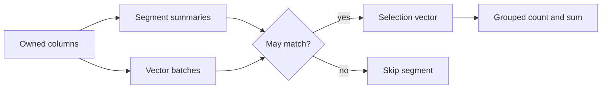

# Columnar Query Engine

Previously `segmentlens`. Package and command names remain unchanged (`segmentlens`).

[简体中文](README_zh.md)

A small CPU columnar execution engine for studying selective analytical filters. It owns typed arrays, evaluates batch selection vectors, and aggregates grouped count/sum. Conservative numeric and categorical summaries can skip impossible segments. Useful for inspecting query-engine mechanics and building reproducible local experiments.

**Scope:** an unofficial independent reproduction of the DuckDB vector-scan/filter/aggregate subsystem, referenced at [`7e1c37c0e961`](https://github.com/duckdb/duckdb/commit/7e1c37c0e96182c8f00843274043a0e7d2f0287e). No upstream code is copied. It does not implement a SQL database. DuckDB already has statistics pruning; our contribution is a directly inspectable typed pipeline, bounded summaries, validation and a B/C experiment—not an algorithmic first or upstream speed claim.



## Install and run

Clone [this repository](https://github.com/hardwork-xu/columnar-query-engine), then run from its root. Python3.11+, NumPy2.3.3; macOS arm64 locally validated, Linux CPU covered by the actual CI job. No keys or model downloads.

```sh
python3 -m venv .venv
. .venv/bin/activate
python -m pip install -r requirements-dev.txt
python -m pip install -e .
python -m segmentlens demo
python -m pytest -q
ruff check src tests
python -m build --no-isolation
OMP_NUM_THREADS=1 OPENBLAS_NUM_THREADS=1 VECLIB_MAXIMUM_THREADS=1 python -m segmentlens bench --output results/local-benchmark.json
python -m segmentlens report results/local-benchmark.json
```

```python
from segmentlens import Table, Query, Predicate, execute
table = Table({"time": [1, 2, 3], "amount": [10, 20, 30], "kind": ["a", "a", "b"]}, segment_size=2)
query = Query("amount", "kind", (Predicate("time", "ge", 2),))
print(execute(table, query).rows)
# [{'key': 'a', 'count': 1, 'sum': 20.0}, {'key': 'b', 'count': 1, 'sum': 30.0}]
```

CLI help is bilingual. `query TABLE.npz QUERY.json --no-prune` selects full-scan B; default `execute(..., prune=True)` enables C. Query JSON has `measure`, `group_by`, and a list of `{"column":"time","op":"ge","value":2}` predicates. The demo runs 4,096 real rows; both paths return the same100 selected rows, while C evaluates256 instead of4,096.

## Measured behavior

Run `segmentlens-bec82c0d6994`: Apple M1 Pro16GiB, Python3.12.2/NumPy2.3.3, CPU, single BLAS thread, synthetic data, segment512, one warm-up and three alternating paired repeats. Median query-only milliseconds below. Setup/load costs and every trial are in [raw results](results/benchmark.json). B/C outputs and native DuckDB1.4.0 correctness references agree. The predefined >=80% row-work reduction target passed at all ordered sizes.

<!-- RESULTS_START -->
| Rows / 行数 | Workload / 负载 | B ms | C ms | Fewer evaluated rows / 求值行减少 |
|---:|---|---:|---:|---:|
| 10000 | ordered_selective | 0.231 | 0.046 | 94.88% |
| 10000 | shuffled_selective | 0.303 | 0.319 | 0.00% |
| 10000 | ordered_all | 1.148 | 1.047 | 0.00% |
| 50000 | ordered_selective | 1.128 | 0.156 | 97.95% |
| 50000 | shuffled_selective | 1.491 | 1.532 | 0.00% |
| 50000 | ordered_all | 5.292 | 5.290 | 0.00% |
| 200000 | ordered_selective | 5.329 | 0.595 | 98.72% |
| 200000 | shuffled_selective | 6.605 | 6.933 | 0.00% |
| 200000 | ordered_all | 21.455 | 21.165 | 0.00% |
<!-- RESULTS_END -->

Unordered data prunes nothing and is slower with C in these trials. Evaluated rows are not disk bytes, RSS or upstream throughput. Arrays load fully into memory. Finite float64/Unicode only; no NULL, SQL parser, joins, updates or crash-safe transactions. See [limitations](docs/en/LIMITATIONS.md). This is experimental software, not a production database.

## Documentation and maintenance

[UPSTREAM_ANALYSIS](docs/en/UPSTREAM_ANALYSIS.md) · [REPRODUCTION](docs/en/REPRODUCTION.md) · [DESIGN](docs/en/DESIGN.md) · [IMPROVEMENTS](docs/en/IMPROVEMENTS.md) · [EXPERIMENTS](docs/en/EXPERIMENTS.md) · [DEVELOPMENT_LOG](docs/en/DEVELOPMENT_LOG.md) · [WALKTHROUGH](docs/en/WALKTHROUGH.md) · [LIMITATIONS](docs/en/LIMITATIONS.md)

`make test`, `make demo`, `make bench`, `make report`, `make build` provide common entry points. `docker build -t segmentlens .` and `docker run --rm segmentlens` run the CPU demo. Docker was unavailable locally; consult the [real CI runs](https://github.com/hardwork-xu/columnar-query-engine/actions/workflows/ci.yml) for container status.

MIT for independently authored code. [Third-party attribution](THIRD_PARTY.md), [NOTICE](NOTICE), [contribution guide](CONTRIBUTING.md), [security](SECURITY.md), [release notes](CHANGELOG.md). Cite the software metadata in [CITATION.cff](CITATION.cff); credit [DuckDB](https://github.com/duckdb/duckdb) for the upstream architecture and established mechanisms.
