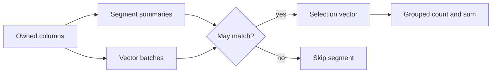

# 列式查询引擎 · Columnar Query Engine

仓库原名 `segmentlens`；包名及现有命令保持不变（`segmentlens`）。

[English](README.md)

用于研究选择性分析查询的小型CPU列式执行引擎：自有类型化数组、批次选择向量、分组count/sum聚合，以及用于跳过不可能命中段的保守数值/类别摘要。适合阅读查询引擎机制和开展可复现本地实验。

**范围：**独立、非官方复现DuckDB的向量扫描/过滤/聚合子系统，固定参考[`7e1c37c0e961`](https://github.com/duckdb/duckdb/commit/7e1c37c0e96182c8f00843274043a0e7d2f0287e)。未复制上游代码，不是完整SQL数据库。DuckDB已经具有统计剪枝；本项目贡献是可直接阅读的类型化流水线、有界摘要、验证及B/C实验，不宣称算法首创或超过上游。



## 安装与运行

克隆[本仓库](https://github.com/hardwork-xu/columnar-query-engine)，在仓库根目录运行。要求Python3.11+、NumPy2.3.3；本地验证macOS arm64，Linux CPU以实际CI为准。无需密钥或模型下载。

```sh
python3 -m venv .venv
. .venv/bin/activate
python -m pip install -r requirements-dev.txt
python -m pip install -e .
python -m segmentlens demo
python -m pytest -q
ruff check src tests
python -m build --no-isolation
OMP_NUM_THREADS=1 OPENBLAS_NUM_THREADS=1 VECLIB_MAXIMUM_THREADS=1 python -m segmentlens bench --output results/local-benchmark.json
python -m segmentlens report results/local-benchmark.json
```

```python
from segmentlens import Table, Query, Predicate, execute
table = Table({"time": [1, 2, 3], "amount": [10, 20, 30], "kind": ["a", "a", "b"]}, segment_size=2)
query = Query("amount", "kind", (Predicate("time", "ge", 2),))
print(execute(table, query).rows)
# [{'key': 'a', 'count': 1, 'sum': 20.0}, {'key': 'b', 'count': 1, 'sum': 30.0}]
```

CLI帮助为双语。`query TABLE.npz QUERY.json --no-prune`使用完整扫描B；`execute(..., prune=True)`默认启用C。JSON字段包括measure、group_by及形如`{"column":"time","op":"ge","value":2}`的谓词列表。demo实际执行4,096行，两条路径均返回100个选中行，C仅求值256行。

## 实测结果

运行`segmentlens-bec82c0d6994`：Apple M1 Pro16GiB、Python3.12.2/NumPy2.3.3、CPU单BLAS线程、合成数据、段512，一次预热、三次交替配对重复。表内为仅查询耗时的毫秒中位数；导入/加载成本与逐次结果见[原始JSON](results/benchmark.json)。B/C输出及原生DuckDB1.4.0正确性参考一致；预设各有序规模至少80%行工作量减少目标全部达到。

<!-- RESULTS_START -->
| Rows / 行数 | Workload / 负载 | B ms | C ms | Fewer evaluated rows / 求值行减少 |
|---:|---|---:|---:|---:|
| 10000 | ordered_selective | 0.231 | 0.046 | 94.88% |
| 10000 | shuffled_selective | 0.303 | 0.319 | 0.00% |
| 10000 | ordered_all | 1.148 | 1.047 | 0.00% |
| 50000 | ordered_selective | 1.128 | 0.156 | 97.95% |
| 50000 | shuffled_selective | 1.491 | 1.532 | 0.00% |
| 50000 | ordered_all | 5.292 | 5.290 | 0.00% |
| 200000 | ordered_selective | 5.329 | 0.595 | 98.72% |
| 200000 | shuffled_selective | 6.605 | 6.933 | 0.00% |
| 200000 | ordered_all | 21.455 | 21.165 | 0.00% |
<!-- RESULTS_END -->

无序数据无剪枝收益，本次各规模C均更慢。求值行不等于物理磁盘字节、RSS或上游吞吐。数组全量载入内存，只支持有限float64/Unicode，无NULL、SQL解析、join、更新或崩溃安全事务。详见[限制](docs/zh/LIMITATIONS.md)。这是实验软件，不是生产数据库。

## 文档与维护

[UPSTREAM_ANALYSIS](docs/zh/UPSTREAM_ANALYSIS.md) · [REPRODUCTION](docs/zh/REPRODUCTION.md) · [DESIGN](docs/zh/DESIGN.md) · [IMPROVEMENTS](docs/zh/IMPROVEMENTS.md) · [EXPERIMENTS](docs/zh/EXPERIMENTS.md) · [DEVELOPMENT_LOG](docs/zh/DEVELOPMENT_LOG.md) · [WALKTHROUGH](docs/zh/WALKTHROUGH.md) · [LIMITATIONS](docs/zh/LIMITATIONS.md)

统一入口：make test/demo/bench/report/build。`docker build -t segmentlens .`、`docker run --rm segmentlens`运行CPU示例。宿主机无Docker，容器状态请检查[真实CI](https://github.com/hardwork-xu/columnar-query-engine/actions/workflows/ci.yml)。

自主代码采用MIT。[第三方归属](THIRD_PARTY.md)、[NOTICE](NOTICE)、[贡献指南](CONTRIBUTING_zh.md)、[安全说明](SECURITY.md)、[版本说明](CHANGELOG.md)。引用元数据见[CITATION.cff](CITATION.cff)，上游架构及成熟机制应归属[DuckDB](https://github.com/duckdb/duckdb)。
